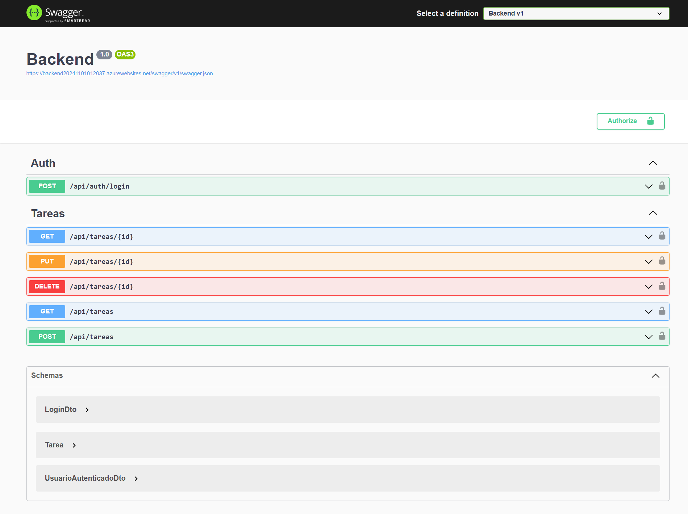
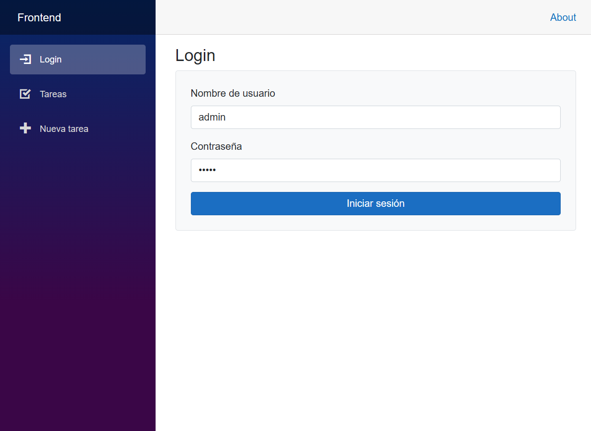
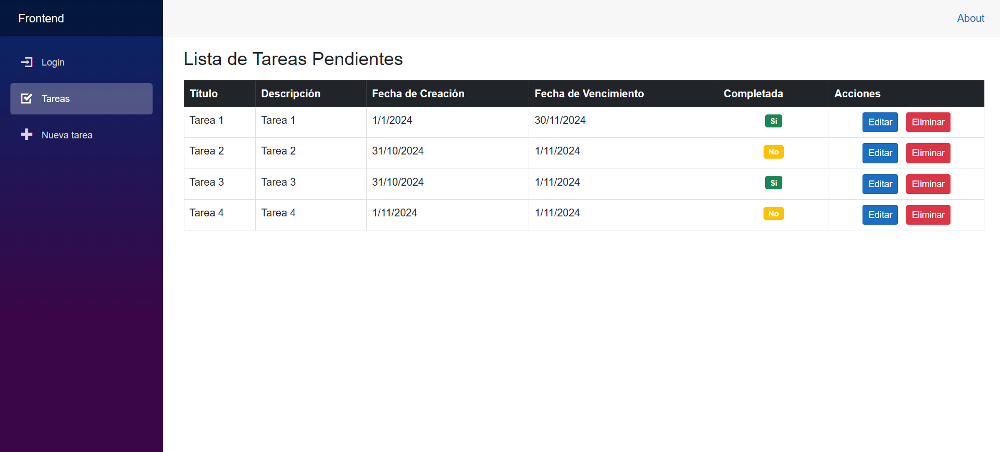
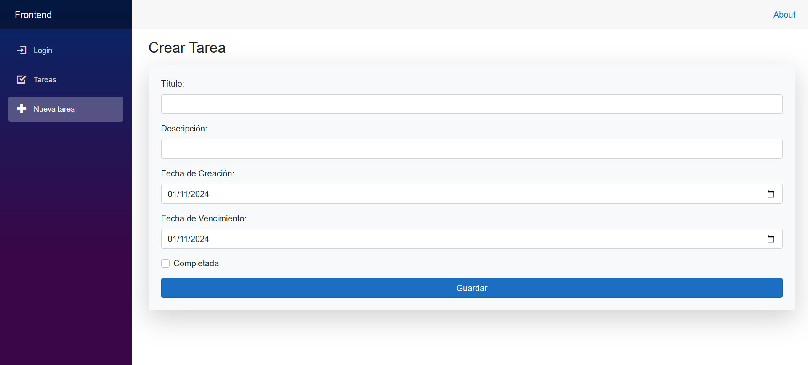
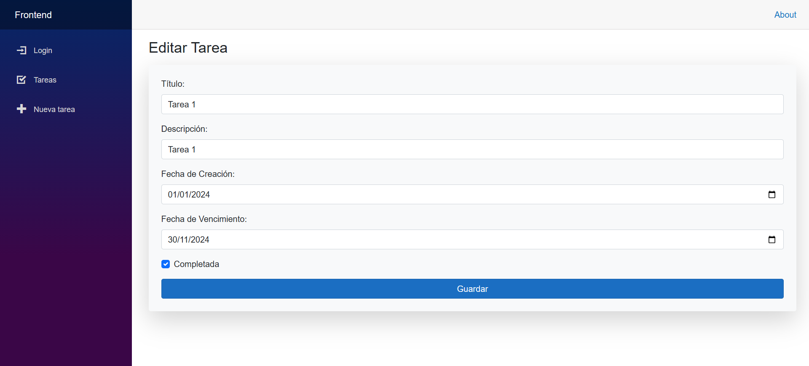
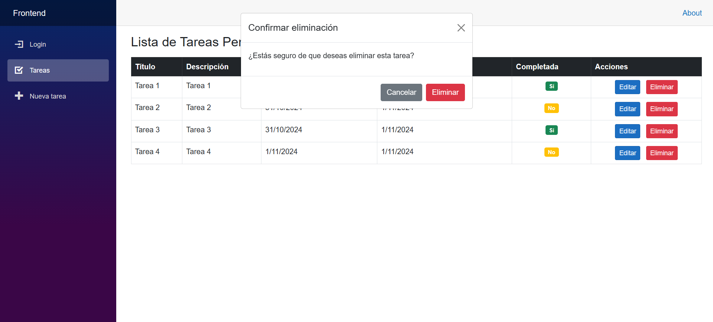

# Evaluación Técnica de Conocimientos Fullstack .NET
### Desarrollado por David Betancourt Naranjo  
**Para Logic Studio**

## Descripción
Este repositorio contiene la solución para la evaluación técnica de conocimientos en .NET Fullstack. La solución está compuesta por dos proyectos desarrollados en .NET 6:

1. **Backend**: API RESTful desarrollada con .NET 6 / Web API.
2. **Frontend**: Aplicación web desarrollada con .NET 6 / Blazor App.

Ambos proyectos han sido desplegados como aplicaciones en Azure para su revisión y prueba en línea.

### Enlaces de las Aplicaciones:
- **Backend** (Web API): [Swagger en Azure](https://backend20241101012037.azurewebsites.net/swagger/index.html)
- **Frontend** (Blazor App): [Aplicación en Azure](https://frontend20241101113607.azurewebsites.net/)

## Capturas de Pantalla

A continuación, se presentan capturas de ambas aplicaciones para una visualización rápida:

### Backend (Swagger)

### Frontend (Blazor App)

---
